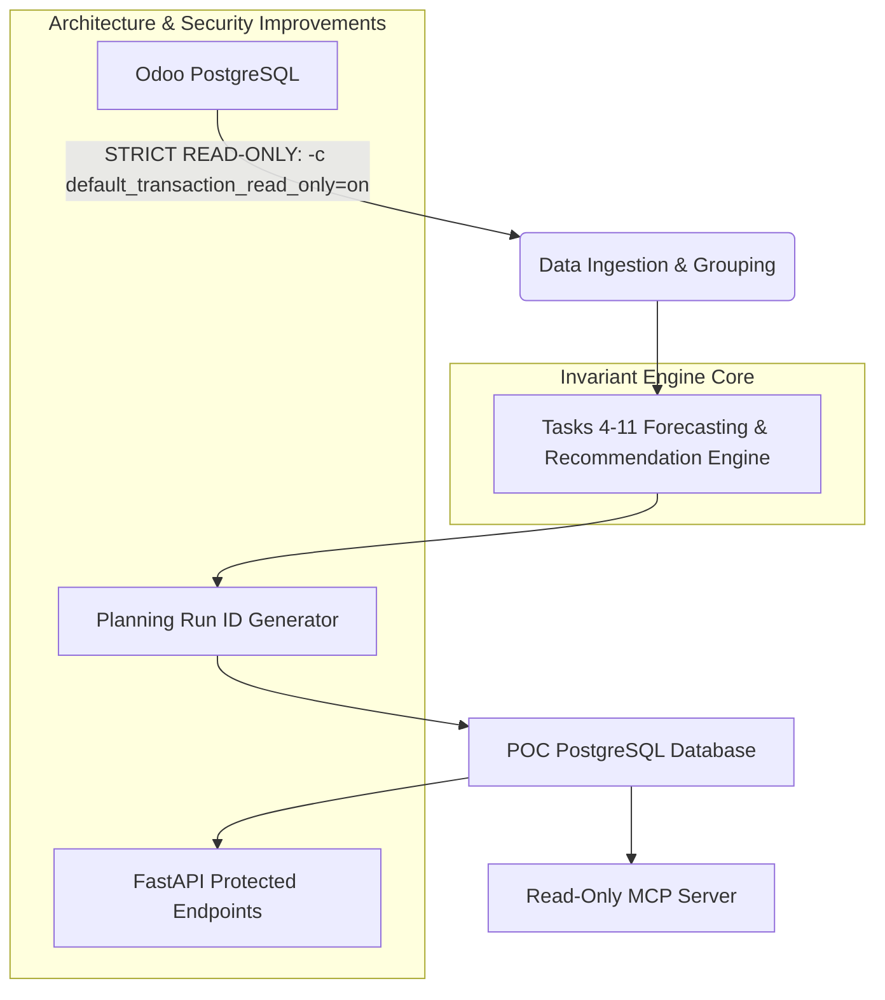

# Inventory Intelligence — Architecture and Security Audit Report

> **Status:** `AUDIT COMPLETE — AWAITING REVIEW BEFORE IMPLEMENTATION`  
> **Date:** October 9, 2026  
> **Target Codebase:** `backend/` (FastAPI, SQLAlchemy, PyJWT, Odoo Connector, Forecasting & Recommendation Engine)  

---

## 1. Executive Summary

This audit evaluates the current Inventory Intelligence codebase against production architecture standards and enterprise security requirements. 

All mathematical models and operational replenishment logic from **Tasks 4–11** (canonical inventory position, 4-month operational horizon, error-based safety stock, out-of-sample confidence scoring, rolling multi-origin model selection, stockout censoring, short-history fallback, and recommendation breakdown), the accepted **Cold-Start Analogue Diagnostic**, and the **Read-Only MCP Server** have been verified and remain strictly protected.

### Audit Summary Matrix

| Category | High Severity | Medium Severity | Low Severity | Informational | Total Findings |
| :--- | :---: | :---: | :---: | :---: | :---: |
| **API Security & Auth** | 3 | 2 | 1 | 0 | **6** |
| **System Architecture & DB** | 2 | 2 | 1 | 0 | **5** |
| **Total** | **5** | **4** | **2** | **0** | **11** |

---

## 2. Findings Ranked by Severity

---

### [CRITICAL / HIGH SEVERITY]

#### 1. Unauthenticated API Endpoints for Sensitive Operations
- **Severity:** `HIGH` (Security)
- **Relevant Files:**
  - [`backend/app/api/main_products.py`](file:///e:/Agent/backend/app/api/main_products.py#L34-L269)
  - [`backend/app/api/inventory.py`](file:///e:/Agent/backend/app/api/inventory.py#L20-L117)
  - [`backend/app/api/procurement.py`](file:///e:/Agent/backend/app/api/procurement.py#L58-L734)
  - [`backend/app/api/approvals.py`](file:///e:/Agent/backend/app/api/approvals.py#L58-L183)
  - [`backend/app/api/products.py`](file:///e:/Agent/backend/app/api/products.py#L21-L71)
  - [`backend/app/api/forecast.py`](file:///e:/Agent/backend/app/api/forecast.py#L14-L83)
  - [`backend/app/api/shadow.py`](file:///e:/Agent/backend/app/api/shadow.py#L35-L182)
- **Evidence:**
  In `main.py`, 9 routers are registered. However, only `auth.py:get_me` declares `Depends(security)` (`HTTPBearer`). All operational and transactional endpoints—including `/api/main-products/{id}/create-po`, `/api/inventory/recommendations/{id}/approve`, `/api/procurement/purchase-orders/create`, and `/api/approvals/{id}/edit`—lack dependency injection for authentication (`Depends(get_current_user)`).
- **Risk:**
  Any unauthenticated client on the network can query proprietary demand and inventory intelligence, approve or reject replenishment recommendations, override target stocks, and trigger draft purchase orders.
- **Remediation Plan:**
  1. Define a shared FastAPI dependency `get_current_active_user` in `backend/app/api/auth.py` that validates the Bearer JWT token.
  2. Apply `dependencies=[Depends(get_current_active_user)]` globally or across protected routers (`main_products`, `inventory`, `procurement`, `approvals`, `products`, `forecast`, `shadow`, `ai`).

---

#### 2. Insecure Fallback JWT Secret Key
- **Severity:** `HIGH` (Security)
- **Relevant File:** [`backend/app/api/auth.py:L14`](file:///e:/Agent/backend/app/api/auth.py#L14)
- **Evidence:**
  ```python
  JWT_SECRET = os.getenv("JWT_SECRET", "super-secret-poc-key")
  ```
- **Risk:**
  If the `JWT_SECRET` environment variable is omitted or misconfigured in production, the application silently defaults to a publicly known hardcoded string (`"super-secret-poc-key"`). An attacker can forge valid HS256 JWT tokens with arbitrary `user_id` and claims, completely bypassing authentication.
- **Remediation Plan:**
  Fail safely on startup. If `os.getenv("JWT_SECRET")` is missing or shorter than 32 characters, raise a `RuntimeError` during server initialization.

---

#### 3. Static Global Salt for Password Hashing
- **Severity:** `HIGH` (Security)
- **Relevant File:** [`backend/app/api/auth.py:L26-L32`](file:///e:/Agent/backend/app/api/auth.py#L26-L32)
- **Evidence:**
  ```python
  def hash_password(password: str) -> str:
      salt = b'some-fixed-salt-for-poc'
      hashed = hashlib.scrypt(password.encode('utf-8'), salt=salt, n=16384, r=8, p=1, maxmem=0)
      return hashed.hex()
  ```
- **Risk:**
  A single hardcoded static salt is shared across all user records in the database. This eliminates salt uniqueness, allowing rainbow table attacks and precomputed dictionary lookups against user hashes across the entire database.
- **Remediation Plan:**
  1. Use cryptographically random 16-byte per-user salts (`os.urandom(16)`) stored alongside the scrypt hash (`salt$hash`), or adopt industry-standard `bcrypt` / `passlib.context.CryptContext`.
  2. Implement a transparent migration path for existing test users.

---

#### 4. Lack of Unique Planning Run IDs & Destructive Overwrites
- **Severity:** `HIGH` (Architecture)
- **Relevant Files:**
  - [`backend/app/db/repository.py:L10-L79`](file:///e:/Agent/backend/app/db/repository.py#L10-L79)
  - [`backend/app/db/group_repository.py:L82-L180`](file:///e:/Agent/backend/app/db/group_repository.py#L82-L180)
- **Evidence:**
  - `save_forecasts()` and `save_recommendations()` execute `df.to_sql(..., if_exists="replace")`, dropping and recreating tables during batch saves.
  - `group_forecast_results` and `group_inventory_recommendations` update via `ON CONFLICT (main_product_template_id) DO UPDATE`.
  - There is no `run_id` or batch run lifecycle table for operational group forecasts.
- **Risk:**
  - Batch generation is not atomic: if a batch run fails halfway, the database is left in a mixed state with half new and half old forecasts.
  - API consumers cannot view consistent point-in-time snapshot results from a specific planning run.
  - Historical provenance and auditability of past forecasts are lost because previous rows are overwritten.
- **Remediation Plan:**
  1. Create a `planning_runs` table (`run_id UUID PRIMARY KEY`, `created_at`, `status`, `run_type`, `num_products`, `metadata`).
  2. Add `run_id` to forecast and recommendation tables, or maintain a dedicated `planning_run_results` table.
  3. Allow API endpoints to default to `latest_completed_run_id` while supporting `?run_id=<uuid>` queries.

---

#### 5. Ephemeral In-Memory Detail Cache & Repeated Live Odoo Recalculations
- **Severity:** `HIGH` (Architecture / Performance)
- **Relevant File:** [`backend/app/api/main_products.py:L92-L210`](file:///e:/Agent/backend/app/api/main_products.py#L92-L210)
- **Evidence:**
  ```python
  _detail_cache: dict[int, dict[str, Any]] = {}

  @router.get("/{main_product_template_id}", ...)
  def persisted_main_product_detail(main_product_template_id: int):
      if main_product_template_id in _detail_cache:
          return _detail_cache[main_product_template_id]
      ...
      live_fc = get_live_group_forecast(main_product_template_id)
  ```
- **Risk:**
  - `_detail_cache` is stored in a process-local Python dictionary. In multi-worker deployments (e.g., `uvicorn --workers 4`), cache misses occur across workers, causing cache incoherence.
  - On every cache miss or server restart, requests trigger live Odoo database queries (`get_group_members`, `get_product_group`) and execute a full 3-month forecast recalculation on the fly.
  - Saturated Odoo connections and high API latency (100ms–1500ms per detail view) occur under concurrent user navigation.
- **Remediation Plan:**
  1. Persist the complete 3-month forecast array (`forecast_3_months`) and group membership metadata during the batch planning run in the POC database.
  2. Serve `/api/main-products/{id}` directly from the persisted database records without live on-the-fly recomputations.

---

### [MEDIUM SEVERITY]

#### 6. Database Connection Engine Instantiation & Missing Pool Configuration
- **Severity:** `MEDIUM` (Architecture)
- **Relevant File:** [`backend/app/db/connection.py:L10-L65`](file:///e:/Agent/backend/app/db/connection.py#L10-L65)
- **Evidence:**
  `get_poc_engine()` and `get_odoo_engine()` execute `create_engine(...)` afresh each time they are invoked. In `group_repository.py`, `_using_engine` creates and disposes an engine on every function call.
  Furthermore, `create_engine` lacks connection pool configuration (`pool_size`, `max_overflow`, `pool_recycle`, `pool_pre_ping`).
- **Risk:**
  - Engine churn causes connection pool proliferation and socket exhaustion under load.
  - Stale connections dropped by PostgreSQL or network timeouts cause unhandled `psycopg2.OperationalError` (missing `pool_pre_ping=True`).
- **Remediation Plan:**
  1. Refactor `connection.py` to maintain singleton engine instances (`_poc_engine`, `_odoo_engine`).
  2. Configure connection pools with `pool_size=10`, `max_overflow=20`, `pool_recycle=3600`, and `pool_pre_ping=True`.

---

#### 7. Absence of Database Schema Migration Framework (Alembic)
- **Severity:** `MEDIUM` (Architecture / Maintainability)
- **Relevant Files:**
  - [`backend/create_table.py`](file:///e:/Agent/backend/create_table.py)
  - [`backend/create_users_table.py`](file:///e:/Agent/backend/create_users_table.py)
  - [`backend/app/db/group_repository.py:L21-L80`](file:///e:/Agent/backend/app/db/group_repository.py#L21-L80)
  - [`backend/app/db/repository.py:L66-L78`](file:///e:/Agent/backend/app/db/repository.py#L66-L78)
- **Evidence:**
  There is no Alembic migration directory or configuration (`alembic.ini`, `migrations/`). Table schemas are managed through ad-hoc Python scripts with raw SQL `CREATE TABLE IF NOT EXISTS` or runtime `ALTER TABLE` statements inside data-saving methods.
- **Risk:**
  - Schema drift between development, staging, and production environments.
  - Inability to roll back schema changes or trace schema version history.
- **Remediation Plan:**
  1. Initialize Alembic (`alembic init migrations`).
  2. Generate baseline migrations for all POC database tables (`users`, `planning_runs`, `group_forecast_results`, `group_inventory_recommendations`, `draft_purchase_orders`, `portal_purchase_orders`, `shadow_*`).

---

#### 8. Unrestricted Public User Registration (`/api/auth/signup`)
- **Severity:** `MEDIUM` (Security)
- **Relevant File:** [`backend/app/api/auth.py:L34-L48`](file:///e:/Agent/backend/app/api/auth.py#L34-L48)
- **Evidence:**
  The `/api/auth/signup` endpoint allows any anonymous caller to create a user record with no role restriction, domain allowlist, invite token, or administrative approval.
- **Risk:**
  Unauthorized external entities could register accounts on internal company infrastructure and obtain access to proprietary inventory valuation and sales forecasts.
- **Remediation Plan:**
  1. Disable open self-registration in production environments or restrict signup to an admin-only endpoint (`@router.post("/users", dependencies=[Depends(require_admin)])`).
  2. Add role-based access control (`role: Literal["admin", "planner", "viewer"]`).

---

#### 9. Odoo Read-Only Access Enforced by Convention Rather Than Driver Constraints
- **Severity:** `MEDIUM` (Security / Data Integrity)
- **Relevant File:** [`backend/app/db/connection.py:L43-L65`](file:///e:/Agent/backend/app/db/connection.py#L43-L65)
- **Evidence:**
  `get_odoo_engine()` establishes a standard read-write connection to Odoo PostgreSQL without specifying read-only transaction parameters. Read-only safety currently depends on the application executing only `SELECT` queries.
- **Risk:**
  If the Odoo database user credentials possess write privileges, a code regression or SQL injection vulnerability could mutate ERP tables.
- **Remediation Plan:**
  1. Enforce driver-level read-only transactions by passing `connect_args={"options": "-c default_transaction_read_only=on"}` to `create_engine`.
  2. Document the requirement for a dedicated PostgreSQL role with `REVOKE ALL ...` and `GRANT SELECT ...` permissions.

---

### [LOW SEVERITY]

#### 10. Database Error Information Leakage in HTTP 500 Responses
- **Severity:** `LOW` (Security / Information Disclosure)
- **Relevant Files:**
  - [`backend/app/api/main_products.py:L230`](file:///e:/Agent/backend/app/api/main_products.py#L230)
  - [`backend/app/api/forecast.py:L26`](file:///e:/Agent/backend/app/api/forecast.py#L26)
  - [`backend/app/api/shadow.py:L160`](file:///e:/Agent/backend/app/api/shadow.py#L160)
  - [`backend/app/api/procurement.py:L270`](file:///e:/Agent/backend/app/api/procurement.py#L270)
- **Evidence:**
  Endpoints catch raw `Exception as e` and pass `detail=str(e)` or `detail=f"Database query failed: {exc}"` directly to the client.
- **Risk:**
  Internal database structure, table names, syntax errors, or connection strings may be revealed to client applications.
- **Remediation Plan:**
  Log the full exception and traceback to standard error/logging, and return a sanitized error message (e.g., `detail="Internal server error. Please contact the administrator."`) to the client.

---

#### 11. Plaintext CORS Permissiveness on Localhost Origins
- **Severity:** `LOW` (Security)
- **Relevant File:** [`backend/app/main.py:L27-L36`](file:///e:/Agent/backend/app/main.py#L27-L36)
- **Evidence:**
  CORS middleware allows `http://localhost:3000` and `http://127.0.0.1:3000` with `allow_credentials=True` and wildcard methods/headers.
- **Risk:**
  Acceptable for development, but requires environment-variable configuration for production domains.
- **Remediation Plan:**
  Load allowed CORS origins from an environment variable (`CORS_ALLOWED_ORIGINS`).

---

## 3. Preservation of Invariants (Tasks 4–11 Baseline)

The following core modules and contracts are audited and verified to remain **100% untouched and invariant**:



1. **Task 4**: Canonical Inventory Position ($\text{IP} = \text{Usable} + \text{Incoming} - \text{Committed}$).
2. **Task 5**: 4-month replenishment horizon ($H = L + R = 4$) with partial-month weighting ($w_0$).
3. **Task 6**: Evidence-based error safety stock ($SS = \min(Z_{\alpha} \times \sqrt{H} \times \sigma_{1M}, \text{Cap})$).
4. **Task 7**: Real out-of-sample error forecast confidence uncoupled from purchase override.
5. **Task 8**: Multi-origin operational model selection over 6 rolling origins.
6. **Task 9**: Stockout month censoring with `STOCKOUT_SUPPRESSED` missing demand handling.
7. **Task 10**: Short-history forecasting ($6 \le N < 18$) with `trimmed_mean_3` fallback and strict seasonality prohibition ($N < 12$).
8. **Task 11**: Transparent structured recommendation calculation breakdown.
9. **Cold-Start Analogue Diagnostic**: Advisory-only Bayesian credibility blend ($z = \frac{N}{N+3}$) with $0$ purchase quantity for $N < 6$.
10. **MCP Server**: Read-only tool exposure over `stdio`.

---

## 4. Minimal Implementation Plan

### Phase 1: Security & Driver Hardening
1. **JWT & Auth Hardening**:
   - Make `JWT_SECRET` mandatory on startup (fail fast).
   - Upgrade password hashing to use `os.urandom(16)` per-user salt + `scrypt` / `bcrypt`.
   - Protect all operational FastAPI routers with `Depends(get_current_user)`.
   - Restrict `/api/auth/signup` to authenticated admins.
2. **Database Engine & Connection Pooling**:
   - Refactor `backend/app/db/connection.py` to use module-level singleton engines.
   - Configure pool parameters (`pool_size=10`, `max_overflow=20`, `pool_recycle=3600`, `pool_pre_ping=True`).
   - Add `connect_args={"options": "-c default_transaction_read_only=on"}` to Odoo engine.
   - Sanitize HTTP 500 error messages.

### Phase 2: Planning Run Architecture & Migration Management
1. **Alembic Setup**:
   - Initialize Alembic under `backend/alembic`.
   - Create baseline migrations for all existing tables.
2. **Planning Run Management**:
   - Create `planning_runs` table (`run_id`, `created_at`, `status`, `metadata`).
   - Associate forecast and recommendation records with `run_id`.
   - Update `/api/main-products` and `/api/main-products/{id}` to read persisted planning run data without live Odoo recalculations.

---

## 5. Items Requiring Clarification Before Implementation

Prior to implementing these architectural and security changes, stakeholder clarification is requested on the following design decisions:

1. **User Role & Signup Strategy**:
   - Should `/api/auth/signup` be disabled entirely in favor of an initial database seed/admin invite, or should domain-restricted self-signup (e.g. `@company.com`) be permitted?
2. **Planning Run Triggering Mechanism**:
   - Should planning runs be triggered via an authenticated API endpoint (`POST /api/planning-runs/trigger`), via a scheduled CLI cron script (`python -m app.scripts.run_planning_cycle`), or both?
3. **Historical Run Retention Policy**:
   - How many historical planning runs should be retained in the POC database before automatic pruning (e.g. last 30 runs vs indefinite)?

---

> **Audit Completion Notice:** This document completes the architecture and security audit. No functional code modifications or git operations have been made.
