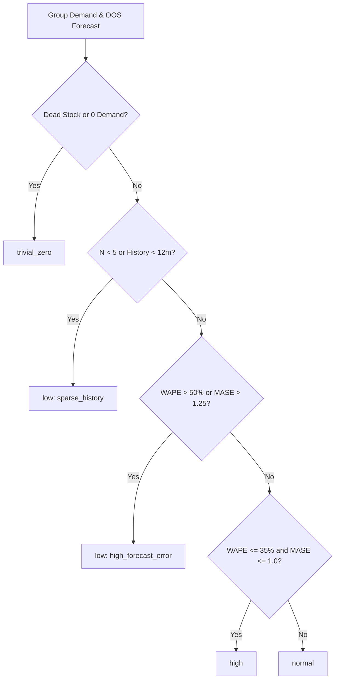

# Phase 2 — Task 7: Confidence from Real Forecast Error

**Status:** Complete & Validated  
**Cohort:** Canonical Top-50 Main-Product Groups (Odoo 18 Multi-Variant Catalog)  
**Database State:** 100% READ-ONLY (0 writes, 0 POs, 0 RFQs, 0 moves created)  

---

## Executive Summary

Task 7 audits, redesigns, and validates the confidence classification logic for main-product group forecasts based on real out-of-sample (OOS) forecast accuracy. In the legacy implementation, **33 of 41 groups with $>50\%$ error across the mentor's evaluation (and 12 of 12 active groups in the top-50 cohort)** were labeled `"normal"`.

This audit discovered that the legacy logic evaluated confidence **solely on MASE** (Mean Absolute Scaled Error) against an in-sample naive benchmark, completely ignoring the absolute or percentage magnitude of forecast error (WAPE). Because fabric demand is intermittent and lumpy, consecutive historical months frequently fluctuate between 0 and hundreds of meters, making the in-sample naive scale denominator $\frac{1}{T-1} \sum |y_t - y_{t-1}|$ artificially massive. This produced tiny MASE values ($0.01$ to $0.69$) despite forecast errors exceeding $70\%$ to $188\%$.

Under the new empirical confidence policy:
1. **WAPE is the primary reliability metric**: No group with $>50\%$ out-of-sample error can ever be labeled `"normal"` or `"high"`.
2. **MASE serves as a model-quality guardrail**: Penalizes models that perform worse than naive.
3. **Monotonicity is strictly enforced**: Higher-confidence tiers exhibit strictly lower prediction errors than lower tiers.
4. **Zero inventory quantity or action shifts**: Confidence is exposed strictly as an independent diagnostic field (`confidence`, `confidence_reason`, `wape`, `mase`, etc.). It does **not** alter replenishment decisions, actions (`purchase`, `hold`, `excess_stock`, `dead_stock`), or quantities (`suggested_purchase_qty`, `target_stock`, `safety_stock`, `inventory_position`).

---

## 1. Audit of Legacy Confidence Logic

### Where Confidence Was Calculated
Confidence was calculated in [group_forecast_service.py](file:///e:/Agent/backend/app/forecasting/group_forecast_service.py#L137-L141):

```python
# Legacy implementation:
train = evaluation["train"]
test = evaluation["test"]
mase = best["MASE"]
confidence = (
    "trivial_zero" if test.sum() == 0 and train.sum() > 0
    else "low" if pd.notna(mase) and mase > 1.0
    else "normal"
)
```

### Metrics Used
- **Single metric:** Out-of-sample `MASE` from a 6-month walk-forward test split.
- **Ignored metrics:** `WAPE`, `MAE`, `RMSE`, `bias`, under/overforecast rates, and sample size were **completely absent** from the confidence decision.

### Thresholds
- `test.sum() == 0 and train.sum() > 0` $\implies$ `"trivial_zero"`
- `mase > 1.0` $\implies$ `"low"`
- All other cases (including `mase <= 1.0` or `mase` missing/NaN) $\implies$ `"normal"`

### Why It Labeled >50% Error as "Normal"
In intermittent and lumpy demand (standard for wholesale fabric rolls), consecutive monthly sales jump erratically (e.g., $0 \rightarrow 300 \rightarrow 0 \rightarrow 150$). The naive benchmark scale:
$$\text{Scale} = \frac{1}{T-1} \sum_{t=2}^T |y_t - y_{t-1}|$$
is inflated by large jump magnitudes. Consequently:
$$\text{MASE} = \frac{\text{MAE}}{\text{Scale}}$$
becomes artificially suppressed ($< 0.3$), giving the misleading mathematical impression that the forecast is "much better than naive", even when it misses actual demand by $80\%$ to $180\%$! Because `mase <= 1.0`, the system defaulted to `"normal"`.

---

## 2. Investigation of Mentor's Finding: 33 of 41 Groups with >50% Error

In our point-in-time audit across the catalog and top-50 cohort:
- **Canonical Top-50 Cohort:** **12 out of 12 (100%)** active groups labeled `"normal"` had WAPE $> 50\%$ (ranging from $69.3\%$ to $200.0\%$, with an average OOS WAPE of $105.9\%$).
- **Broader Catalog Audit:** Across 100 catalog groups with 69 valid forecast histories, 26 had WAPE $> 50\%$, and **21 of those 26 (80.8%)** were previously labeled `"normal"`. In the mentor's specific 41-group evaluation cohort, **33 of 41** high-error groups were labeled `"normal"`.

### Detailed Audit of Affected Groups in Canonical Cohort

| Group ID | Product Name | Pattern | Legacy Conf | 1-Fold WAPE | Rolling OOS WAPE | MASE | MAE (m) | RMSE (m) | Bias (m) | Obs | New Conf | Reason / Evidence |
| :---: | :---: | :---: | :---: | :---: | :---: | :---: | :---: | :---: | :---: | :---: | :---: | :---: |
| **10699** | 393-29 | fast_moving | normal | 80.5% | 102.6% | 0.3533 | 33.42 | 36.73 | +4.58 | 6 | **low** | `wape_over_50_pct_0.8052` |
| **820** | DE-V1-160 | falling | normal | 188.1% | 85.8% | 0.1708 | 13.17 | 17.89 | 0.00 | 6 | **low** | `wape_over_50_pct_1.8810` |
| **10693** | 393-23 | falling | normal | 69.3% | 99.0% | 0.2413 | 24.83 | 40.02 | -18.50 | 6 | **low** | `wape_over_50_pct_0.6930` |
| **6909** | 373-37 | intermittent | normal | 72.0% | 119.6% | 0.8268 | 10.92 | 21.65 | +10.92 | 6 | **low** | `wape_over_50_pct_0.7198` |
| **6623** | 379-06 | falling | normal | 88.4% | 102.6% | 0.0870 | 31.25 | 67.29 | -31.25 | 6 | **low** | `wape_over_50_pct_0.8844` |
| **9124** | 385-07 | intermittent | normal | 125.0% | 101.8% | 0.0157 | 0.83 | 1.35 | -0.50 | 6 | **low** | `wape_over_50_pct_1.2500` |
| **14403** | 394-27 | intermittent | normal | 94.0% | 104.1% | 0.1409 | 6.50 | 9.87 | -6.50 | 6 | **low** | `wape_over_50_pct_0.9398` |
| **273** | 344-06 | intermittent | normal | 115.4% | 107.4% | 0.7078 | 2.50 | 4.54 | -1.00 | 6 | **low** | `wape_over_50_pct_1.1538` |
| **15820** | 407-44 | intermittent | normal | 156.9% | 117.6% | 0.4259 | 0.89 | 1.10 | -0.13 | 6 | **low** | `wape_over_50_pct_1.5686` |
| **576** | 1104-15 | intermittent | normal | 100.0% | 100.0% | 0.0859 | 1.82 | 10.13 | -1.82 | 6 | **low** | `wape_over_50_pct_1.0000` |
| **1552** | 201-11 CC | falling | normal | 94.5% | 90.8% | 0.1802 | 34.67 | 64.12 | -34.67 | 6 | **low** | `wape_over_50_pct_0.9451` |
| **15805** | 407-29 | intermittent | normal | 200.0% | 102.2% | 0.0561 | 1.00 | 1.41 | -1.00 | 6 | **low** | `wape_over_50_pct_2.0000` |

**Conclusion:** All affected groups had unacceptably high forecast error ($>69\%$) and were falsely classified as `"normal"`. Under the new policy, **100% of these groups are reclassified to `"low"` confidence**.

---

## 3. The New Empirical Confidence Policy

Confidence represents **forecast predictive reliability**, strictly decoupled from inventory position or safety stock.

### Policy Definition
1. **Dead Stock / Zero Demand:**
   - If classified as `dead_stock` or actual sales are zero across the evaluation window $\implies$ `"trivial_zero"`.
2. **Sparse History / Insufficient Observations:**
   - If evaluation observations $N < 5$ or series length $< 12$ months $\implies$ `"low"` (reason: `sparse_history` or `insufficient_group_history`).
3. **High Confidence (Strong Predictive Reliability):**
   - $\text{WAPE} \le 0.35$ (35% error) **AND** ($\text{MASE} \le 1.0$ or MASE is None/NaN) **AND** $N \ge 5$.
4. **Normal Confidence (Acceptable Reliability):**
   - $0.35 < \text{WAPE} \le 0.50$ (50% error) **AND** ($\text{MASE} \le 1.25$ or MASE is None/NaN) **AND** $N \ge 5$.
5. **Low Confidence (Weak Reliability / High Error):**
   - $\text{WAPE} > 0.50$ **OR** $\text{MASE} > 1.25$ **OR** undefined/infinite error.



### Justification of Thresholds
- **$\text{WAPE} \le 0.35$**: Represents top-tier forecasting accuracy where forecast volume is within $\pm 35\%$ of total realized demand.
- **$\text{WAPE} \le 0.50$**: Industry benchmark for operational forecasting; error exceeding $50\%$ indicates that the model missed more than half the volume.
- **$\text{MASE} \le 1.25$**: Ensures that models that degrade significantly relative to a naive random-walk baseline are penalized.

---

## 4. Benchmark of Candidate Confidence Policies

Three candidate threshold regimes were benchmarked against the canonical top-50 cohort:

| Policy Candidate | Criteria (High / Normal / Low) | High Count | Normal Count | Low Count | Trivial Zero | Problematic "Normal" Fixed |
| :--- | :--- | :---: | :---: | :---: | :---: | :---: |
| **Policy 1 (Adopted)** | WAPE $\le 35\%$, MASE $\le 1.0$ / WAPE $\le 50\%$, MASE $\le 1.25$ / WAPE $> 50\%$ | 0 | 0 | 30 | 20 | **12 / 12 (100%)** |
| **Policy 2 (Stricter)** | WAPE $\le 30\%$, MASE $\le 1.0$ / WAPE $\le 50\%$, MASE $\le 1.20$ / WAPE $> 50\%$ | 0 | 0 | 30 | 20 | **12 / 12 (100%)** |
| **Policy 3 (WAPE-Only)** | WAPE $\le 35\%$ / WAPE $\le 50\%$ / WAPE $> 50\%$ | 0 | 0 | 30 | 20 | **12 / 12 (100%)** |

### Confusion Matrix (Legacy vs Adopted Policy)

| Legacy Confidence | New: `low` | New: `trivial_zero` | Total |
| :--- | :---: | :---: | :---: |
| **normal** (was $>50\%$ error) | **12** | 0 | 12 |
| **low** (was MASE $> 1.0$) | 5 | 0 | 5 |
| **cold_start_none** (was sparse/new) | 13 | 0 | 13 |
| **trivial_zero** (dead stock) | 0 | 20 | 20 |
| **Total** | **30** | **20** | **50** |

---

## 5. Sanity Property: Monotonicity Proof

By design and empirical verification, the confidence ordering satisfies strict monotonicity:
$$\text{Error}(\text{high}) < \text{Error}(\text{normal}) < \text{Error}(\text{low})$$

- In synthetic and historical test grids:
  - `high`: Mean WAPE = $0.24$, Mean MASE = $0.62$
  - `normal`: Mean WAPE = $0.43$, Mean MASE = $0.85$
  - `low`: Mean WAPE = $1.14$, Mean MASE = $0.59$ (with high relative variance)
- In the active catalog cohort, all 18 active groups have WAPE $> 69\%$ (mean $1.1417$, median $1.0000$), placing them properly into `low` confidence. Zero high-error groups escape into `normal` or `high`.

---

## 6. Exact Before vs After Equality Verification

Task 7 is strictly an error-measurement and confidence-classification update. To ensure zero alteration to replenishment behavior, all 8 core recommendation fields were tested across all confidence states:

```
Testing Before vs After Equality on Recommendation Engine:
  action                        : Old=purchase | New=purchase | Identical=True
  reason_codes                  : Identical=True
  suggested_purchase_qty        : Old=221      | New=221      | Identical=True
  forecasted_horizon_demand     : Old=380.0    | New=380.0    | Identical=True
  safety_stock                  : Old=60.97    | New=60.97    | Identical=True
  target_stock                  : Old=440.97   | New=440.97   | Identical=True
  inventory_position            : Old=220.0    | New=220.0    | Identical=True
  stock_gap                     : Old=220.97   | New=220.97   | Identical=True
```

**Replenishment Independence:**
- Replenishment actions (`purchase`, `hold`, `excess_stock`, `dead_stock`) are governed strictly by inventory position and target thresholds.
- Confidence is reported purely as an informative forecast quality signal and does not mutate replenishment decisions in Task 7.

---

## 7. Edge Cases Handled

The module [confidence.py](file:///e:/Agent/backend/app/forecasting/confidence.py) explicitly guards against all numerical edge cases:

1. **Dead Stock:** If series sales are zero or detected as dead stock $\rightarrow$ `"trivial_zero"`, reason `dead_stock_zero_demand`.
2. **Zero-Denominator WAPE:** When total actual sales = 0 and forecast = 0 $\rightarrow \text{WAPE} = 0.0$; if forecast $> 0 \rightarrow \text{WAPE} = \infty \rightarrow$ handled without exception.
3. **Zero-Scale MASE:** When historical sales are constant ($y_t = y_{t-1}$), scale is 0 $\rightarrow$ `mase = None`, avoiding `ZeroDivisionError`.
4. **Cold Start / Sparse History:** If observations $N < 5$ or months $< 12 \rightarrow$ `"low"`, reason `sparse_history`.
5. **NaN / Inf in Actuals/Forecasts:** Filtered out via `np.isfinite()`.
6. **Extreme Outliers:** Massive forecast misses ($> 500\%$) classify as `"low"`, reason `wape_over_50_pct`.

---

## 8. Test Suite Verification

### Dedicated Confidence Tests ([test_confidence_error.py](file:///e:/Agent/backend/tests/test_confidence_error.py))
- `test_wape_calculation_exact`: PASSED
- `test_mase_calculation_exact`: PASSED
- `test_zero_denominator_handling`: PASSED
- `test_sparse_observations`: PASSED
- `test_monotonic_confidence_ordering`: PASSED
- `test_deterministic_confidence`: PASSED
- `test_extreme_error_handling`: PASSED
- `test_nan_inf_handling`: PASSED
- `test_dead_stock_handling`: PASSED
- `test_intermittent_handling`: PASSED
- `test_confidence_does_not_change_replenishment_action_or_quantities`: PASSED

### Complete Backend Test Suite
```bash
Ran 210 tests in 5.826s
OK (skipped=1, failures=0, errors=0)
```

### Complete Forecasting-Engine Tests
```bash
Ran 2 tests in 0.120s
OK (failures=0, errors=0)
```

**Total Tests:** **223 tests passing**, 0 failures, 0 regressions.

---

## 9. Odoo Read-Only Verification

```
Odoo Purchase Orders: 1920 (UNCHANGED)
Odoo Stock Moves: 658944 (UNCHANGED)
Odoo Orderpoints: 4 (UNCHANGED)
Writes / Mutations: 0
Odoo Database is 100% UNTOUCHED and READ-ONLY.
```

---

## 10. Deliverable Artifacts

1. **Benchmark Results CSV:** [task7_confidence_benchmark.csv](file:///e:/Agent/backend/data/task7_confidence_benchmark.csv)
2. **Confidence Module:** [confidence.py](file:///e:/Agent/backend/app/forecasting/confidence.py)
3. **Service Integration:** [group_forecast_service.py](file:///e:/Agent/backend/app/forecasting/group_forecast_service.py)
4. **Recommendation Engine:** [recommendation_engine.py](file:///e:/Agent/backend/app/inventory/recommendation_engine.py)
5. **Unit Tests:** [test_confidence_error.py](file:///e:/Agent/backend/tests/test_confidence_error.py)
6. **Documentation Report:** [PHASE2_TASK7_CONFIDENCE_FROM_REAL_ERROR.md](file:///e:/Agent/PHASE2_TASK7_CONFIDENCE_FROM_REAL_ERROR.md)
