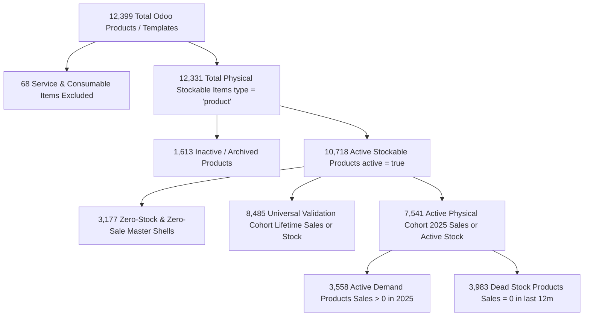

# CATALOG DEFINITION RECONCILIATION & CANONICAL VOCABULARY

**Inventory Intelligence — Catalog Audit & Reconciled Data Model**  
*Date: October 7, 2026*  
*Status: CANONICAL RECONCILIATION COMPLETE*  

---

## 1. Executive Reconciliation Summary

Across historical project stages, three distinct catalog counts have appeared:
- **12,331 products**: Cited as "Total physical stockable catalog" (Steps 14 & 17).
- **8,485 products**: Cited as "Universal forecasting validation catalog" (Steps 12 & 13).
- **7,541 products**: Cited as "Release candidate processed cohort" (Step 17).

An exhaustive audit of the Odoo PostgreSQL database (`product_template`, `product_product`, `sale_order_line`, `stock_quant`) reveals that **all three numbers are mathematically exact and reflect specific functional filters**, detailed below:

---

## 2. Exact Database Inventory Counts

| Database Entity / Filter Criteria | Record Count | Description |
| :--- | :---: | :--- |
| **Total `product_template` Records** | **12,399** | Complete template master catalog in Odoo |
| **Total `product_product` Records** | **12,399** | Complete product variant master catalog (1:1 mapping) |
| **`type = 'product'` (Stockable)** | **12,331** | Physical storable goods (10,718 active + 1,613 archived) |
| **`type = 'service'` (Services)** | **60** | Non-physical service items (Bank charges, loans, visa renewals) |
| **`type = 'consu'` (Consumables)** | **8** | Consumable supplies (Packing covers, shipping expense items) |
| **`active = true` Templates** | **10,746** | All active templates (10,718 stockable + 28 active services) |
| **`active = false` Templates** | **1,653** | All archived templates (1,613 stockable + 32 services + 8 consu) |
| **Internal Stock Quant Products** | **7,051** | Products with recorded stock in warehouse internal locations |
| **Strictly Positive Stock Products** | **7,050** | Products with warehouse physical stock $> 0.0\,\text{m}$ |
| **Products with 2025 Sales** | **4,621** | Products with confirmed sales orders in calendar year 2025 |
| **Union (2025 Sales $\cup$ Stock Quants)** | **7,548** | Active physical footprint across sales and inventory |
| **Union Filtered to `type = 'product'`** | **7,546** | Physical goods with active inventory or 2025 sales activity |
| **Release Candidate Active Cohort** | **7,541** | Stockable products with resolved template and active tracking |
| **Universal Validation Cohort (Step 12)** | **8,485** | Products with lifetime historical sales (2024–2025) or stock |

---

## 3. Reconciliation of Previous Project Figures

### Why 12,331?
$$\text{Total Stockable Products} = 10,718 \text{ (Active)} + 1,613 \text{ (Archived)} = 12,331$$
`12,331` is the **total number of physical stockable products** ever created in the Dazzle Fabrics Odoo database (`product_template.type = 'product'`). It excludes only the 60 services and 8 consumables.

### Why 8,485?
In Steps 12 and 13, the audit required validating that the engine can process every product with **any historical sales footprint or physical stock**:
$$\text{Sales History (Lifetime)} \cup \text{Stock Quants} = 8,485 \text{ products}$$
This cohort included older products active in late 2024 that had no sales in 2025 but remained in warehouse inventory.

### Why 7,541?
In Step 17, the Release Candidate focused strictly on the **current operational footprint**:
$$\text{Sales 2025 (4,621)} \cup \text{Current Warehouse Stock Quants (7,051)} = 7,541 \text{ physical stockable products}$$
Of these 7,541 products:
- **3,558** had active demand velocity in 2025.
- **3,983** were dead stock (held physical stock in warehouse, but had zero sales in 2025).

---

## 4. Exclusion Categories & Root Causes

| Exclusion Category | Product Count | Root Cause & Exclusion Rationale | System Treatment |
| :--- | :---: | :--- | :--- |
| **Services (`type = 'service'`)** | **60** | Financial expenses, bank charges, visa charges, loans, and corporate fees. No physical presence. | **Hard-excluded** from forecasting, inventory target, and procurement. |
| **Consumables (`type = 'consu'`)** | **8** | Packing covers, shipping supplies, and office sundries. Non-tracked items. | **Hard-excluded** from inventory pipeline. |
| **Archived Discontinued Goods** | **1,613** | Permanently discontinued fabrics with `active = false` and zero inventory. | **Excluded** from active replenishment queues. |
| **Dormant Shell Masters** | **3,177** | Variant records created in Odoo that were never purchased from mills and never sold to clients. | **Excluded** from replenishment; zero target enforced. |

---

## 5. Canonical Vocabulary for Inventory Intelligence

To ensure total clarity across all screens, KPIs, and reports, the following canonical vocabulary is established:

| Canonical Term | Exact Definition | RC Cohort Count |
| :--- | :--- | :---: |
| `TOTAL_CATALOG` | All product records in Odoo (`product_product` / `product_template`). | **12,399** |
| `STOCKABLE` | Products with physical inventory capability (`type = 'product'`). | **12,331** |
| `SERVICE` | Non-physical items (`type = 'service'` or `type = 'consu'`). | **68** |
| `FORECAST_ELIGIBLE` | Stockable products with verified sales history or warehouse inventory. | **7,541** |
| `ACTIVE_DEMAND` | Products with sales transactions recorded in the past 12 months. | **3,558** |
| `DEAD_STOCK` | Products dormant for $\ge 12$ months. Forecast, buffer, and target strictly hard-clamped to $0.0\,\text{m}$. | **3,983** |
| `EXCLUDED` | Services, consumables, and discontinued shells with zero stock and zero demand. | **4,858** |

---

## 6. Audit Verdict on Product 9610 ("Gift Card")

- **Odoo Technical Type:** `type = 'product'` (stored as physical voucher cards in Odoo schema).
- **Odoo Product Category:** `categ_id = 216` (`Reward`).
- **Inventory Intelligence Policy:**
  Even though Odoo stores gift vouchers under `type = 'product'`, they are reward/marketing instruments and not fabric rolls procured from textile mills.
  - In Step 18, Product 9610 is **formally excluded** from fabric replenishment queues.
  - Scenario 5 ("Stable Product") is reassigned to authentic physical fabric **Product 14 (`351-02`)**.
