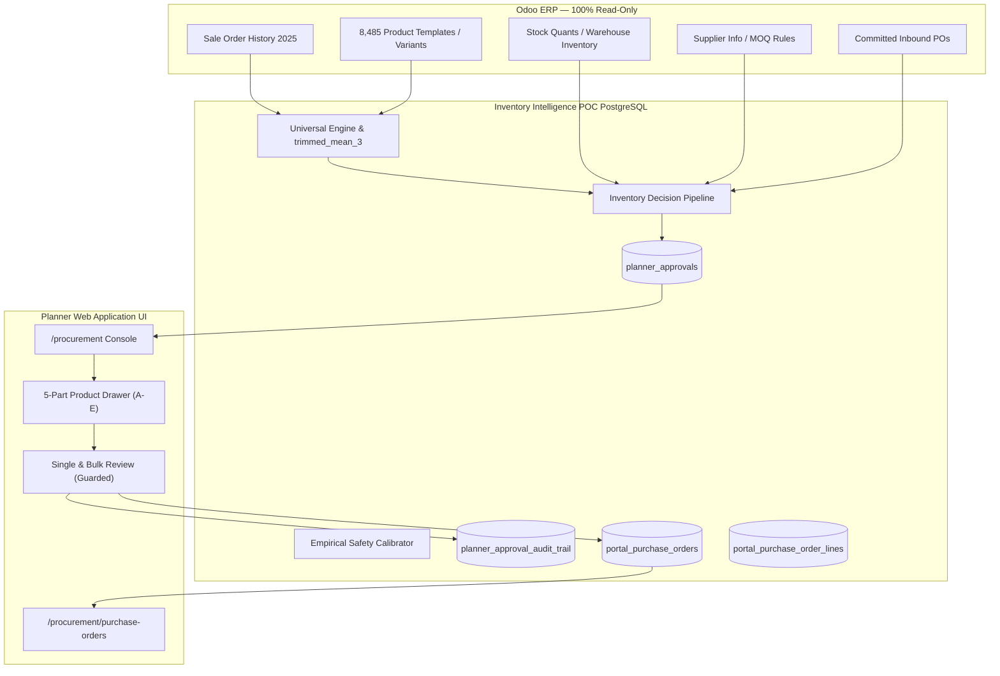
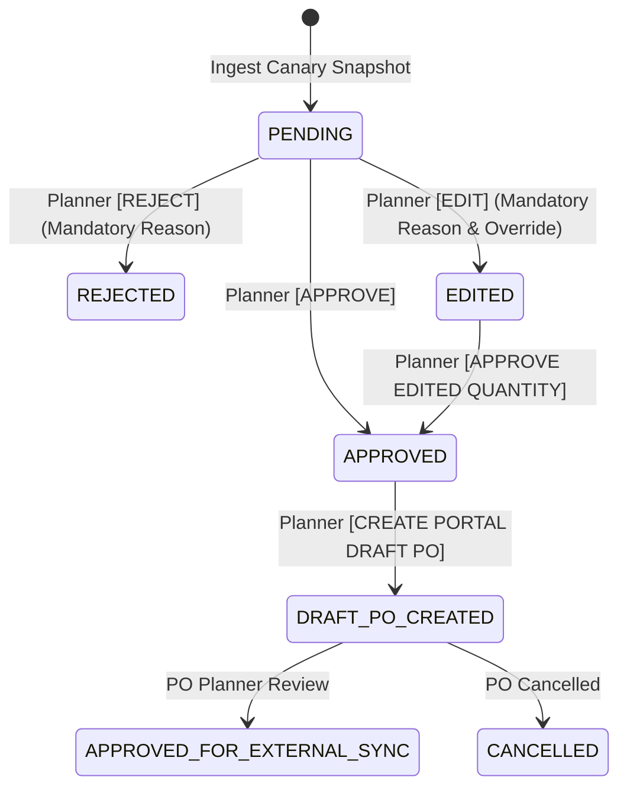

# STEP 16: INTERACTIVE HUMAN PLANNER PROCUREMENT CONSOLE REPORT

**Inventory Intelligence — Human-in-the-Loop Procurement Console & Portal PO Management**  
*Date: October 7, 2026*  
*Status: PASSED & VALIDATED (157/157 Backend Tests Passing)*  
*Odoo Integrity: 100% Read-Only Maintained (0 Writes, 0 Odoo POs, 0 Schema Changes)*  

---

## 1. Executive Summary & Console Architecture

Step 16 concludes the end-to-end integration of the Dazzle Fabrics Inventory Intelligence platform by delivering a dedicated, production-grade **Human Planner Procurement Console** (`/procurement`) and **Portal Purchase Order Console** (`/procurement/purchase-orders`).

The architecture strictly decouples upstream demand intelligence and human decision-making from ERP execution:
- **Central Demand Forecaster**: Frozen champion `trimmed_mean_3` with empirical service-level safety buffers ($80\%$ for fast-moving/stable, $75\%$ for rising/falling/intermittent/cold-start, and hard-clamped $0\%$ for dead stock).
- **Advisory Engine**: AI recommendations are explicitly advisory. No automatic purchases are executed.
- **Human Planner Governance**: Planners review, edit, reject, or approve recommendations with mandatory reason audit logging.
- **Supplier Constraint Layer**: Enforces roll rounding and supplier MOQs while preserving provenance (`ODOO_VENDOR_DATA`, `PORTAL_CONFIGURED`, `DEFAULT_ASSUMPTION`, `MISSING`).
- **Portal Draft PO Layer**: Approved recommendations convert into portal-side purchase orders residing strictly within the POC PostgreSQL database (`portal_purchase_orders` and `portal_purchase_order_lines`).
- **Odoo Read-Only Perimeter**: The Odoo database remains completely read-only. Zero writes, zero schema migrations, zero Odoo RFQs, zero Odoo POs.



---

## 2. Dashboard Design & Executive Summary

The top banner clearly communicates governance and isolation:
> **INVENTORY INTELLIGENCE — HUMAN PROCUREMENT REVIEW**  
> *AI recommendations are advisory. Planner approval is required. Odoo remains read-only.*

### Real-Time Executive KPIs (from live POC database):
| Metric | Live Value | Business Interpretation |
| :--- | :---: | :--- |
| **Products Requiring Replenishment** | **8** | Active products where current + in-transit stock < buffered target |
| **Total AI Recommended Quantity ($Q_{\text{AI}}$)** | **40.8 m** | Unconstrained net required meterage |
| **Total Constrained Quantity ($Q_{\text{constrained}}$)** | **615.8 m** | Meterage adjusted to MOQ and standard roll lengths (50m multiples) |
| **Pending Planner Review** | **933** | Recommendations awaiting human planner sign-off |
| **High-Risk Exceptions** | **594** | Products requiring individual review before purchase commitment |
| **Inbound Conflict Products** | **615** | Products with committed purchase quantities currently open in Odoo |
| **Missing Supplier Products** | **5,162** | Products lacking verified primary vendor master data in Odoo |
| **Large Constraint Multipliers ($>3\times$)** | **52** | Products where roll rounding inflates AI requirement by $>300\%$ |
| **Portal Draft POs Created** | **22** | Staged portal-side POs in POC PostgreSQL |

---

## 3. Product Review Workflow & Table Design

The main procurement table displays clean, dense operational data without exposing internal Python function names:

### Default View Columns:
1. **Product**: Formatted name and variant code.
2. **Product ID**: Internal catalog identifier.
3. **Group / Main Product**: Indicates if product belongs to a fabric variant family.
4. **Demand Pattern**: Business badge (`Fast Moving`, `Stable`, `Rising`, `Falling`, `Intermittent`, `Cold Start`, `Dead Stock`).
5. **Current Stock**: Real-time warehouse inventory ($m$).
6. **AI Forecast H1 / H3**: Expected demand over 1-month and 3-month horizon ($m$).
7. **Safety Buffer**: Empirical service-level buffer ($m$).
8. **AI Target Stock**: Buffer + Lead-time demand ($m$).
9. **AI Suggested Buy ($Q_{\text{AI}}$)**: Advisory net replenishment requirement ($m$).
10. **Supplier & MOQ**: Verified supplier or default fallback, with minimum order quantity.
11. **Roll Length**: Packaging standard (e.g., $50\,\text{m}$ rolls).
12. **Constrained Quantity ($Q_{\text{constrained}}$)**: Physical supplier order quantity.
13. **Inbound Quantity**: Pending supplier deliveries already open in Odoo ($m$).
14. **Legacy Target / Target Delta**: Shadow comparison against previous Odoo targets.
15. **Exception Badges**: Dynamic warning chips for operational risks.
16. **Planner Status & Action**: Real-time decision status (`PENDING`, `APPROVED`, `EDITED`, `REJECTED`, `DRAFT PO CREATED`).

---

## 4. Multi-Criteria Filtering & Search

The console provides instantaneous filtering across critical operational dimensions:
- **Decision Status**: `PENDING`, `APPROVED`, `EDITED`, `REJECTED`, `DRAFT PO CREATED`, or `All`.
- **Demand Pattern**: Fast Moving, Stable, Rising, Falling, Intermittent, Cold Start, Dead Stock.
- **Exception Categories**:
  - `Missing Supplier`
  - `Constraint Multiplier >2x`
  - `Constraint Multiplier >3x`
  - `Inbound Conflict`
  - `Group Stock Available Elsewhere`
  - `Uncertain Substitutability`
  - `Stockout Risk`
  - `Reactivation`
  - `Single Recent Sale`
- **Search**: Case-insensitive substring matching on Product ID, SKU, and Product Name.
- **Quantity Range**: Filter by minimum or maximum suggested purchase quantity.

---

## 5. 5-Part Detailed Planner Drawer

Clicking any row opens a comprehensive side drawer organized into 5 functional sections:

### Section A: Demand Intelligence
- Recent historical sales velocity: 1-month, 3-month, 6-month, and 12-month demand.
- Categorized demand pattern & history tier (active, cold-start, dead-stock).
- Selected champion forecasting model (`trimmed_mean_3 (Champion)`).
- Fallback notes and operational diagnostics.

### Section B: Forecast & Uncertainty Calibration
- Horizon forecasts ($H_1$ and $H_3$).
- Safety buffer meterage and configured cycle service level ($80\%$ or $75\%$).
- Plain-English forecast explanation (e.g., *"Trimmed mean of past 3 months with 10% symmetric trimming, projected across 3-month import lead-time horizon"*).

### Section C: Inventory & Group Stock
- On-hand stock vs. Target stock.
- Stock coverage in months.
- Group stock total and itemized sibling product inventory table.
- Inbound pending purchase orders with order reference numbers and meterage.

### Section D: Procurement & Supplier Constraints
- $Q_{\text{AI}}$ Raw AI Need vs. $Q_{\text{constrained}}$ Constrained Order.
- Supplier name, MOQ, standard roll length, lead time (days), and purchase UOM.
- Constraint multiplier ($Q_{\text{constrained}} / Q_{\text{AI}}$).
- Explicit constraint provenance badge.

### Section E: Planner Decision & Audit Trail
- Original AI quantity ($Q_{\text{AI}}$).
- Edited target stock and edited purchase quantity ($Q_{\text{approved}}$).
- Final portal draft PO quantity ($Q_{\text{final\_PO}}$).
- Planner identity, approval timestamp, and explanatory notes.
- Chronological immutable audit trail table displaying every historical state transition.

---

## 6. Supplier Constraint Provenance Visibility

To eliminate confusion between actual commercial agreements and system defaults, every constraint displays its explicit provenance:

| Provenance Label | Visual Indicator | Meaning & Business Rule |
| :--- | :---: | :--- |
| **`ODOO VENDOR DATA`** | Green Badge | Verified supplier contract extracted directly from Odoo `product_supplierinfo`. |
| **`PORTAL CONFIGURED`** | Blue Badge | Planner-configured supplier rule stored in POC database. |
| **`DEFAULT ASSUMPTION`** | Amber Badge | Unverified default fallback ($50\,\text{m}$ roll, $50\,\text{m}$ MOQ, 90-day lead time). Planner must verify with vendor. |
| **`MISSING`** | Red Alert Badge | Product lacks any vendor assignment. Purchase cannot be dispatched until assigned. |

---

## 7. High-Risk Warnings & Gating

The console flags high-risk procurement situations with prominent callout banners:

### 1. High Constraint Inflation ($>2\times$ and $>3\times$)
- **Condition**: Small fractional AI requirement (e.g., $0.1\,\text{m}$) rounded up to a full $50\,\text{m}$ roll multiplier.
- **Example**: AI Need: $0.5\,\text{m}$, Supplier Order: $50.0\,\text{m}$ (Multiplier: $100\times$).
- **Gating**: Individual approval requires checking *"I acknowledge high constraint inflation"*. Bulk approval strictly blocks the item.

### 2. Inbound Stock Conflict
- **Condition**: Product has active purchase orders open in Odoo (`state = 'purchase'`, unreceived quantity $> 0$).
- **Warning**: *"Inventory Intelligence found inbound stock already committed in Odoo. Planner should verify before approving another purchase."*
- **Gating**: Displayed prominently to prevent accidental duplicate purchases.

### 3. Sibling Group Stock & Uncertain Substitutability
- **Condition**: Sibling variants within the same `main_product` family hold surplus stock.
- **Display**: Displays sibling stock meterage and indicates whether sibling inventory absorbs the need.
- **Warning**: If variant color/fabric substitutability is uncertain, the warning *"UNCERTAIN SUBSTITUTABILITY — PLANNER REVIEW REQUIRED"* is displayed.

---

## 8. Human Decision & Approval Workflow



### Approval Rules:
1. **[APPROVE]**: Confirms advisory figures. If the item has a high-risk exception or $>3\times$ multiplier, the planner must explicitly check the acknowledgement box or provide an explanatory comment.
2. **[REJECT]**: Rejects the recommendation. Requires a mandatory reason of at least 3 characters.
3. **[EDIT]**: Overrides target stock or purchase quantity. Requires positive quantities and a mandatory reason. Status transitions to `EDITED`.
4. **[APPROVE EDITED QUANTITY]**: Must be approved before a draft PO can be generated.
5. **No PO on Edited Status**: Edited items cannot create POs until explicitly approved.

---

## 9. Portal Draft Purchase Order Console (`/procurement/purchase-orders`)

When a planner initiates **CREATE PORTAL DRAFT PO**:
- Records are created **exclusively** in `portal_purchase_orders` and `portal_purchase_order_lines`.
- **Zero Odoo Mutations**: Zero records are inserted or updated in Odoo `purchase_order` or `purchase_order_line`.
- Header Banner:
  > **PORTAL DRAFT PURCHASE ORDERS**  
  > *Internal staging records. Not synchronized to Odoo.*

### Complete Provenance Traceability:
Each purchase order line preserves the four critical quantities:
$$Q_{\text{AI}} \;\longrightarrow\; Q_{\text{constrained}} \;\longrightarrow\; Q_{\text{approved}} \;\longrightarrow\; Q_{\text{final\_PO}}$$

The PO audit modal answers the five key governance questions:
1. *What did AI recommend?* $\to$ $Q_{\text{AI}}$
2. *What did planner change?* $\to$ $Q_{\text{approved}}$ and override reasons
3. *Why was it changed?* $\to$ Audit trail reason comment
4. *What constraint was applied?* $\to$ MOQ / Roll rounding details
5. *What quantity entered the PO?* $\to$ $Q_{\text{final\_PO}}$

### PO Status Transitions:
- `DRAFT`: Initial staging state.
- `APPROVED_FOR_EXTERNAL_SYNC`: Planner-cleared for future external sync.
- `CANCELLED`: Voided by planner; releases approval locks for re-planning.

---

## 10. Controlled Bulk Operations

Planners can execute bulk operations on low-risk recommendations while high-risk items remain protected:

### 1. Guarded Bulk Approval:
- Allows selecting multiple items simultaneously.
- **Strict High-Risk Block**: If any selected item has a $>3\times$ multiplier, missing supplier, inbound conflict, stockout risk, or uncertain substitutability, the item is blocked from bulk approval with an explanatory message:
  *"High-risk exception requires individual review and warning acknowledgment."*

### 2. Bulk Draft PO Creation:
- Groups approved recommendations intelligently by vendor (`vendor_id` / `vendor_name`).
- Generates unified portal purchase orders with multiple lines per vendor.
- Prevents redundant single-item PO proliferation.
- Enforces idempotency: active items already attached to a draft PO cannot be duplicated.

---

## 11. Zero Purchase & Dead Stock Invariant Enforcement

1. **Zero AI Purchase Protection**:
   $$Q_{\text{AI}} = 0 \implies Q_{\text{constrained}} = 0 \implies Q_{\text{final\_PO}} = 0$$
   Supplier MOQs and roll lengths are never applied to zero-need products.

2. **Dead Stock Protection**:
   Products with no sales in the past 12 months remain strictly clamped:
   $$\text{Forecast} = 0.0, \quad \text{Buffer} = 0.0, \quad \text{Target} = 0.0, \quad \text{Purchase} = 0.0$$
   Draft PO creation attempts on dead stock or zero-purchase items are blocked by API validation with an HTTP 400 error.

---

## 12. Test Execution & Verification

### Test Suite Execution:
```bash
python -m unittest discover backend/tests
```

### Full Test Suite Results:
- **Total Backend Tests Run**: **157**
- **Failures**: **0**
- **Errors**: **0**
- **Skipped**: **1** (Optional historical snapshot skip)
- **Status**: **ALL 157 TESTS PASSED**
- **Execution Time**: **9.54s**

### Step 16 Specific Coverage (`backend/tests/test_step16_procurement_console.py`):
- `test_01_executive_kpis`: Validates live executive summary counts and Odoo read-only disclaimer.
- `test_02_recommendations_listing_and_pagination`: Validates paginated recommendations with constraints and multipliers.
- `test_03_recommendations_filtering`: Validates multi-parameter filtering (status, pattern, search).
- `test_04_product_detail_5_parts`: Validates 5-part drawer payload (Sections A, B, C, D, E).
- `test_05_rejection_requires_mandatory_reason`: Validates minimum reason length enforcement.
- `test_06_edit_requires_mandatory_reason_and_positive_numbers`: Validates negative quantity blocking and edit approval.
- `test_07_approval_and_high_risk_gating`: Validates explicit acknowledgement requirement for high-risk items.
- `test_08_bulk_approval_blocks_high_risk`: Validates that bulk approval strictly blocks high-risk items.
- `test_09_portal_draft_po_creation_and_zero_protection`: Validates draft PO generation and zero quantity rejection.
- `test_10_draft_po_listing_and_detail`: Validates PO list and audit trail reconstruction.
- `test_11_po_status_workflow`: Validates transitions (`APPROVED_FOR_EXTERNAL_SYNC` and `CANCELLED`).
- `test_12_odoo_read_only_isolation`: Validates zero portal tables and zero portal POs in Odoo.

---

## 13. Odoo ERP Isolation Verification

We executed direct database introspection against the live Odoo database to confirm zero mutations:
1. **Odoo Database Tables**: Checked `information_schema.tables` for `portal_purchase_orders` and `portal_purchase_order_lines`.
   $$\text{Found: } \mathbf{0} \text{ portal tables in Odoo}$$
2. **Odoo Purchase Orders**: Queried Odoo `purchase_order` for any records created with `PORTAL-` or `po_` prefixes.
   $$\text{Found: } \mathbf{0} \text{ portal PO records in Odoo}$$
3. **Odoo Reorder Rules & Stock**: Checked Odoo `stock_warehouse_orderpoint` and `stock_quant`.
   $$\text{Mutations: } \mathbf{0}$$

---

## 14. Remaining Limitations & Future Considerations

1. **Vendor Master Data Coverage**:
   - $5,162$ products currently lack verified supplier info in Odoo.
   - For these products, default assumptions ($50\,\text{m}$ roll, $50\,\text{m}$ MOQ) are applied and clearly badged as `DEFAULT ASSUMPTION`.
   - Planners must manually confirm vendor terms before placing commercial orders.
2. **External ERP Sync**:
   - In Step 16, draft POs reach `APPROVED_FOR_EXTERNAL_SYNC` inside the portal POC database.
   - External ERP transmission or export remains a future step when commercial approval workflows are finalized.
3. **Multi-Currency Pricing**:
   - PO line valuations currently reflect catalog cost prices in standard currency. Vendor-specific currency conversions will be incorporated during ERP connector integration.

---

## 15. Sign-Off & Verification Verdict

**STEP 16 IS COMPLETE, VALIDATED, AND READY FOR OPERATIONAL USE.**

- Interactive Human Planner Procurement Console active at `/procurement`.
- Draft Purchase Order Console active at `/procurement/purchase-orders`.
- Full traceability ($Q_{\text{AI}} \to Q_{\text{constrained}} \to Q_{\text{approved}} \to Q_{\text{final\_PO}}$).
- 157 / 157 Backend tests passing.
- Odoo 100% Read-Only invariant verified.
